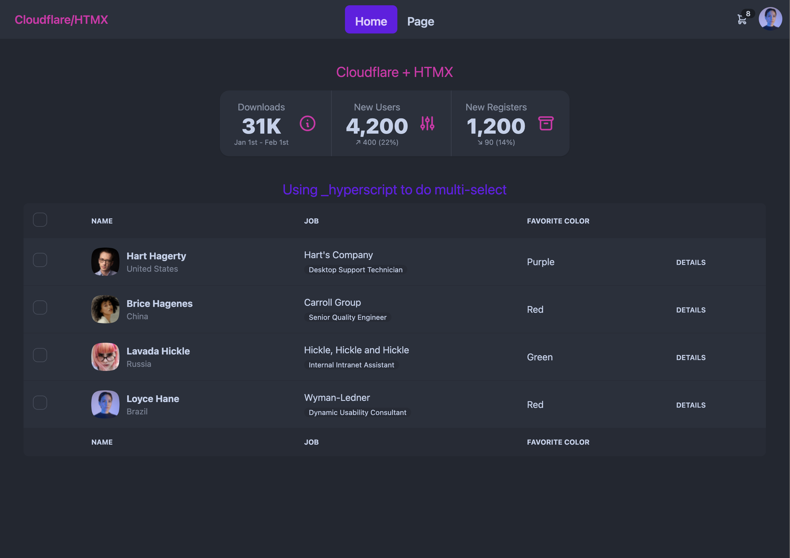

# Cloudflare Pages + HTMX

This is a starter project to create a zero-build web-app using [HTMX](https://htmx.org/) on [Cloudflare](https://dash.cloudflare.com/). It uses [\_hyperscript](https://hyperscript.org) for additional (rare) client side JS and [TailwindCSS](https://tailwindcss.com/) and [DaisyUI](https://daisyui.com/) for styling and theme.

## Live Demo



[https://cloudflare-htmx.pages.dev/](https://cloudflare-htmx.pages.dev/)

## Getting Started

```bash
$ git clone https://github.com/stukennedy/cloudflare-htmx.git
$ cd cloudflare-htmx
$ npm i
$ npm run dev
```

- NextJs-style routing files, written in Typescript, are found in the `functions` folder.
- (don't change the `_middleware.ts`)
- Endpoints should return HTML strings wrapped in a `new Response()`.
- `import { html, htmlResponse } from "@src/lib/html"` declaration allows a string template to be syntax highlighted in VS Code
- layout files wrap all `GET` responses in peer files and subdirectories ... add a layout file to the `src/layouts` folder and add the new layout to the `src/routes.ts` file to tell the app which folder the layout is for.

### HTMX

[HTMX](https://htmx.org/) is a lightweight javascript library that encourages webapps to be built using HATEOAS.

HATEOAS (Hypermedia as the Engine of Application State) is a constraint of the REST application architecture. It keeps the REST style architecture unique from most other network application architectures.

This means we return HTML from every endpoint request and never JSON. HTMX makes it easy to trigger asynchronous requests for data e.g. directly from a button click or page load ... and then allows you the control on where to place the HTML that the backend responds with.

### Cloudflare Pages

[Cloudflare Pages](https://developers.cloudflare.com/pages/) utilise the Cloudflare CDN to provide Typescript Edge Functions in the cloud and provides a simple framework for developing and deploying serverless webapps.
This allows us to build scalable web-apps that are server rendered, whilst maintaining the dynamic asynchronous experience that Single Page Applications have enjoyed.

### \_hyperscript

[\_hyperscript](https://hyperscript.org/docs) is a small library that allows javascript to be executed on dom tags in a more functional way without writing scripts with code. This is useful for bits of dynamic UI e.g. multi-selecting rows of checkboxes.
